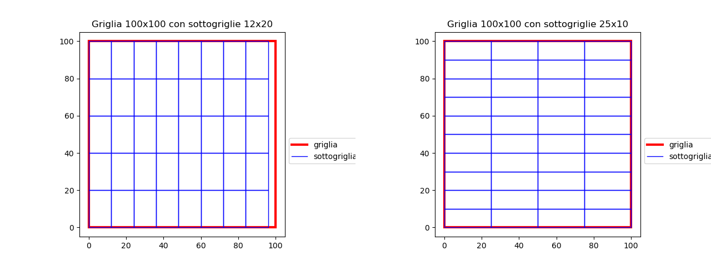

## Abstract

This work aims to predict the execution time for the launch of the COSMO model on HPC (Galileo) using Deep Learning techniques.

When fully operational and under normal conditions, the various configurations of the model remain unchanged and the execution times are substantially well defined. However, an accurate prediction of the execution time of a model allows a better allocation of the available resources, an easier identification of the best configuration in terms of time and a rapid and effective reaction in the face of variations in the available resources (e.g. temporary decrease of the number of nodes due to malfunctions or the introduction of new concurrent jobs).

Furthermore, an integral part of the work will consist in carrying out the experiments necessary to create the dataset, in order to be able to train and test the model.

The model is based on a fixed square domain, which can have various resolutions and be divided into a variable number of subdomains of various shapes (see chapter 1 for further details and further parameters considered), which is used as a basis for the simulations ( performed with a variable number of nodes and cores).

Each real case can be traced back to the reference squared domain: through an analytical procedure, it is possible both to find the normalized input on which to make the predictions and to proportionally calculate the expected execution time for the real grid on the basis of that expected for the reference square (the analytical procedure is being defined, see issue #4).

The goodness of the procedure (prediction on the normalized domain + analytical procedure) can be done based on simulations carried out with the COSMO 2I domain (576x701 points with 0.02 grid pitch in the rotated domain).

------------------------------------------------------------------------------------------------------------------------
## Indice

1. [Individuazione dei parametri e dei loro range](#individuazione-dei-parametry-e-dei-loro-range)
2. [Compilazione ed esecuzione del modello](#compilazione-ed-esecuzione-del-modello)

## Individuazione dei parametri e dei loro range

Il modello meteorologico è rappresentato su un grigliato. Nel nostro caso,
consideriamo un dominio quadrato la cui dimensione geografica è fissa e che
viene suddiviso in un grigliato regolare, in cui ogni cella è quadrata ed ha
medesime dimensioni; chiamamo il lato di questa cella il passo di griglia.

Il modello viene eseguito in parallelo su un numero di processi pari al
prodotto tra numero di nodi e numero di core per nodo: il dominio (il
grigliato) viene suddiviso in sottodomini rettangolari tutti uguali e ognuno di
questi sottodomini viene elaborato da un processo. La suddivisione in
sottodomini non deve essere esatta: se rimangono fuori dei punti, il modello li
redistribuisce. Nell'immagine qui sotto, si può vedere un esempio di
suddivisione in sottodomini rispettivamente non esatta ed esatta.

I parametri individuati sono dunque:
- numero di core per nodo.
- numero di nodi.
- risoluzioni.
- dimensione X e Y dei sottodomini (sia quadrate che rettangolari, con lati > 5
  punti), il cui numero è pari al numero di processi (core * nodi).
- accensione/spegnimento della fisica.
- singola/doppia precisione.

Si considera la risoluzione in un range tra 0.01 e 0.1 gradi (precisione al
millesimo) e un dominio quadrato che abbia tra i 100 e i 1000 punti per lato
(l'estremo inferiore è scelto sulla base dell'efficacia dell'elaborazione e
quello superiore per limiti computazionali). Quindi, l'area geografica del
dominio può essere definita tra le coordinate sud-ovest `(0.0, 0.0)` e le
coordinate nord-est `(10.0, 10.0)`. La posizione geografica della griglia è
ininfluente ai fini del calcolo dei tempi di esecuzione. Le risoluzioni che è
possibile utilizzare sono quelle sottomultiple del dominio, quindi `0.01,
0.016, 0.02, 0.025, 0.04, 0.05, 0.08, 0.1`.

Le possibili dimensioni dei sottodomini sono in funzione del numero di processi
usati e della risoluzione del dominio.

Possiamo quindi definire i seguenti range:

- numero di core per nodo: da 10 a 36.
- numero di nodi: da 10 a 60.
- passo di griglia: 8, da 0.010 a 0.100 (precisione al millesimo), ma solo
  quelli sottomultipli dell'area geografica.
- sottodomini possibili: variano al variare di passo di griglia e numero di
  processi.
- singola/doppia precisione: booleano.
- accensione/spegnimento della fisica: booleano.

Per poter lanciare gli esperimenti, è necessario avere una stima di massima del
tempo necessario. La stima è stata fatta usando il tempo di esecuzione di 1h di
COSMO 2I (70s).

La griglia di COSMO 2I ha passo di griglia 0.02 ed è composta da 576 * 701
punti (403776) e sono usati 864 processi. Quindi, è stato fatta una
proporzione, considerando che:
- ogni raddoppio di risoluzione implica un fattore ~8 di incremento del tempo
  di calcolo (in quanto quadruplicano i punti e si dimezza il delta t)
- l'uso di singola precisione diminuisce di un 30% il tempo di esecuzione
- lo spegnimento della fisica diminuisce di un 30% il tempo di esecuzione

La formula (per brevità è stata omessa la parte relativa alla singola
precisione e allo spegnimento della fisica) utilizzata è la seguente:

    70 * (( 0.02 / grid_step)^3) * (403776 / 250000) * 864 / n_procs

Nel file [calcolo_combinazioni.py](calcolo_combinazioni.py) sono state calcolate
tutte le combinazioni possibili per i range indicati. Tuttavia, ci sono delle
combinazioni che non sono realistiche, quindi sono stati applicati i seguenti filtri:

1. Tempo di esecuzione < 500s
2. Rapporto tra dimensioni X e Y del sottodominio tra 1 e 5

Inoltre, sono state selezionate solo alcune risoluzioni delle 8 disponibili:
`0.02, 0.04, 0.05, 0.08, 0.10`. Le rimanenti risoluzioni (`0.01, 0.016 e
0.025`) saranno prese in considerazione solo nel caso in cui rimanga tempo.

Secondo le stime, questo spazio dovrebbe essere esplorato tutto in tempi
compatibili con le scadenze.

## Compilazione ed esecuzione del modello

### Preliminari

Su galileo le home directory sono chiuse a vicenda ma c'è uno spazio comune di progetto chiamato `$WORK` che per noi dovrebbe valere `/gpfs/work/smr_prod`, per cui verifica se anche per te `$WORK` punta a quella cartella.

### Preparazione dei dati iniziali e al contorno

Per ogni risoluzione scelta è necessario preparare un set di dati iniziali (file grib `lafYYYYmmddHH`) e al contorno (file grib `lbffddHH0000`) a partire da un modello su un'area piùù grande, nel caso specifico cosmo-5M i cui volumi completi sono disponibili online per l'ultima settimana su galileo in cartelle con nome tipo `gpfs/meteo/lm/galileo/auto/archive/PROD/00/Monday/o_lm5_ope_forecast`. Per ogni risoluzione è inoltre necessario disporre di un file di dati fisiografici costanti sulla griglia scelta, normalmente preparato usando un servizio web del DWD a partire da vari dataset globali.

Un esempio semplificato di setup è proposto in `/gpfs/work/smr_prod/srcintel/int2lm`; si compone dei file:

 * `extdata_???.nc` dati fisiografici constanti per i vari passi di griglia (in /1000 di grado), per l'occasione in netcdf)
 * `INPUT` namelist di configurazione per il programma di interpolazione
 * `int2lm.job` script di esecuzione

Per creare i set di dati iniziali e al contorno si deve adattare la namelist `INPUT` per ogni risoluzione scelta:

Data del run, non dipende dalla risoluzione, ovviamente, eventualmente da adattare in base ai dati al contorno scelti (v. sotto)

    ydate_ini='2020102600', ydate_bd='2020102600',

Angolo Sud-Ovest della griglia, uguale a tutte le risoluzioni, lo puoi adattare per centrare l'area sulla zona prescelta (verifica ad es. da un grib risultante, questo è l'angolo SO attuale di cosmo_2I)

    startlat_tot=-8.5, startlon_tot=-3.8,

Dimensione e passo della griglia, da adattare a ciascuna risoluzione (notare n+1 nella dimensione)

    ielm_tot=201, jelm_tot=201
    dlon=0.05, dlat=0.05,

Dimensione della griglia dei dati fisiografici (da verificare con `ncdump` nel relativo file) e nome del file

    ie_ext=801, je_ext=851,
    ylmext_lfn='extdata_050.nc',

Cartella da cui prendere i dati di cosmo_5M

    yinext_cat='/gpfs/meteo/lm/galileo/auto/archive/PROD/00/Monday/o_lm5_ope_forecast'
    yin_cat='/gpfs/meteo/lm/galileo/auto/archive/PROD/00/Monday/o_lm5_ope_forecast',

E poi lanciare lo script `int2lm.job` n volt, una per ogni risoluzione, e mettere da parte il risultato `laf*` e `lbff*`, gli altri file di diagnostica si possono buttare.

Per essere rigorosi, essendo questo un job parallelo, lo si dovrebbe lanciare come job batch con le chiavi di slurm nei commenti come indicato di seguito per cosmo, usando il comando sbatch, ma essendo una procedura abbastanza rapida e leggera dovrebbe funzionare anche in modo interattivo, almeno per le risoluzioni più basse che richiedono poca memoria. Ti risparmio la compilazione del programma di interpolazione int2lm, lo script richiama la versione operativa già compilata.

P.S. ncdump è disponibile facendo `module load autoload netcdf`.

### Compilazione

Su galileo in `$WORK/srcintel` ci sono i sorgenti di Cosmo, alcune dipendenze (netcdf e grib_api) e un README su come compilare il tutto con il compilatore Intel che è più performante di gnu e quindi preferito da Cineca. Le cartelle spacchettate forse non sono tutte copiabili perché il tutto è di proprietà di un altro utente, ma si può copiare i vari tar.gz e compilare seguedo pedissequamente il README.

Il file `Fopts` in cosmo viene incluso dal Makefile principale per definire le opzioni di compilazione, probabilmente ai fini della tesi non interessa tanto pistolarlo, ma la cosa su cui si può giocare è `-DSINGLEPRECISION` per compilare a singola precisione rispetto al default a doppia.

### Lanciare il modello

C'è un esempio di job batch `cosmo.job` che mostra come lanciare cosmo in modalità parallela. Il job si sottopone allo scheduler con il comando `sbatch`. Le prime righe (commenti speciali) del job indicano quanti nodi usare e quanti processi per nodo lanciare, questi parametri si possono anche specificare in alternativa nella linea di comando di `sbatch`.

Istruzioni più dettagliate su come configurare un run alla prossima puntata.
